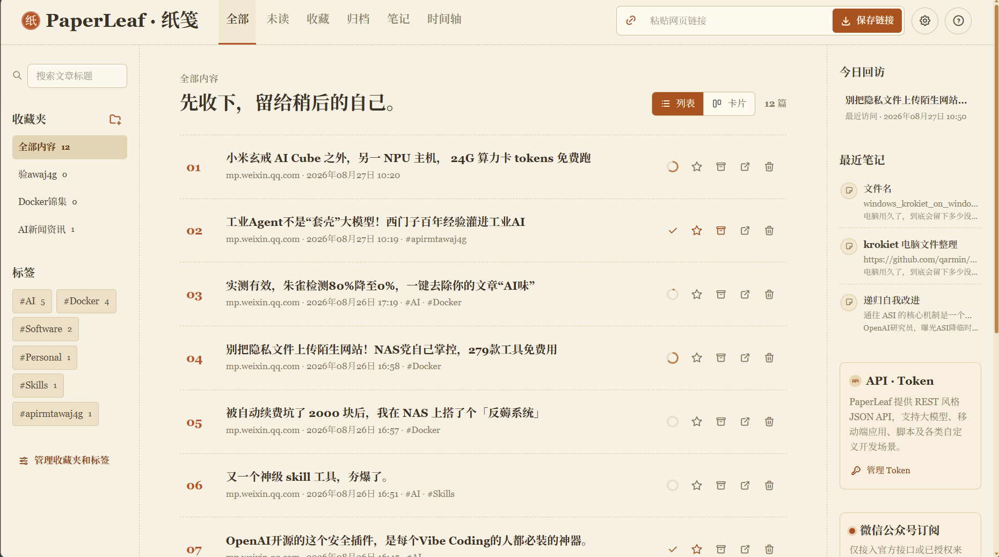
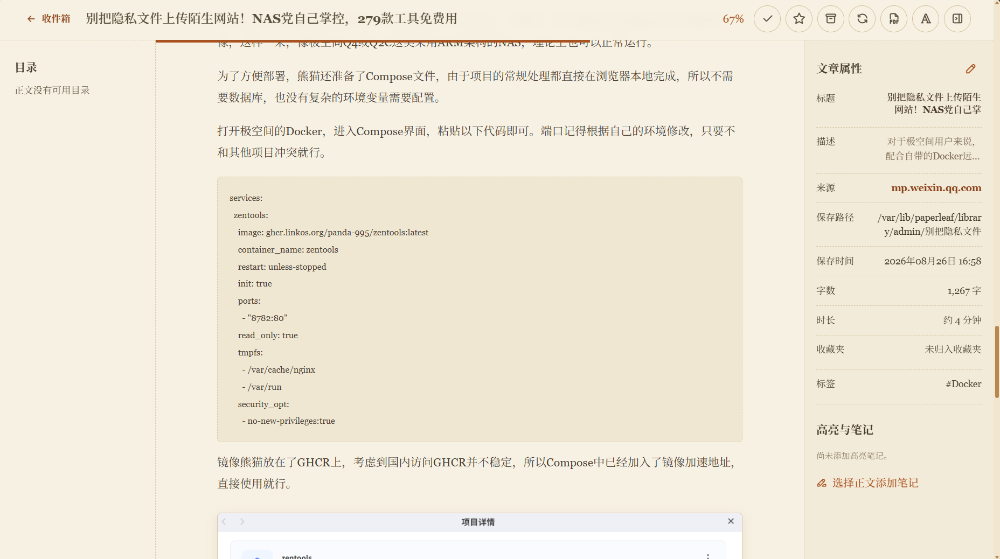
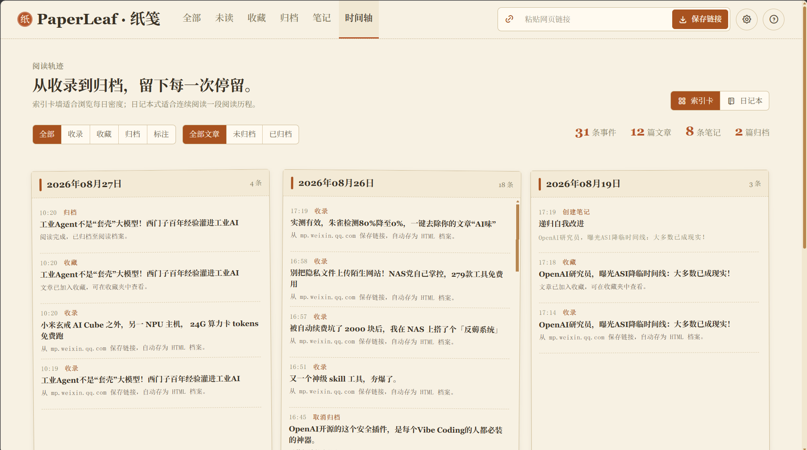

# PaperLeaf · 纸笺 v0.0.3

PaperLeaf（中文名：纸笺）是一个用于保存、净化和离线阅读网页的个人阅读服务。v0.0.3 基于 v0.0.2 独立演进，以 Docker Compose 作为标准部署方式，同时保留 Node.js 本地启动与自动化验收能力。

## 功能范围

| 模块 | 已实现功能 |
| --- | --- |
| 网页保存 | 保存原始 URL；抓取公开网页；提取标题、描述和正文；净化为安全 HTML 快照；抓取失败时保留失败原因并可重试 |
| 本地文章库 | 每篇文章保存独立 HTML 和已下载图片；远程图片下载失败时保留原地址；原网址失效后仍可阅读已归档内容 |
| 阅读器 | 三栏阅读页、目录跳转、阅读进度保存及恢复、已读/未读切换、收藏、归档、重新抓取、按需生成并查看 PDF、图片放大、高亮与笔记 |
| 组织管理 | 全部、未读、归档、收藏四个视图；标签、收藏夹、标题搜索、列表和卡片视图切换 |
| 笔记管理 | 顶部“笔记”工作区；文章标题、笔记内容或高亮片段的分维度检索；双栏查看；原位编辑；跳回对应文章高亮位置 |
| 数据管理 | 管理员导出或导入完整服务 JSON 数据；导入在设置页内确认后覆盖数据库数据并要求重新登录；浏览器会话不导出，文章本地归档文件不自动删除 |
| 账户与用户 | 用户修改密码与退出登录；管理员可创建用户、查看角色并删除其他用户及其全部关联数据；密码不设最小长度但不得为空 |
| API | 站内 API 文档；26 个 REST 风格 JSON Bearer Token 公开接口，覆盖文章（Bookmarks）、高亮笔记、标签、收藏夹、时间轴及管理员数据导入导出；左侧导航按页面分组，可独立展开接口目录并直接跳到接口锚点；支持大模型、移动端应用、脚本和自定义客户端调用 |
| Edge 扩展 | Manifest V3 扩展，可保存当前页面链接或已选文字；支持标签选择与 `#标签名` 回车创建、连通性测试、Token 查看和跳转网页版 |
| 合规边界 | 不包含个人微信登录、Cookie 托管、模拟客户端或规避平台风控的抓取能力 |

## 当前交付状态

| 范围 | 状态 |
| --- | --- |
| 文章首页、阅读器、独立笔记、时间轴、收藏夹与标签管理 | 已实现。 |
| 设置、用户、Token 与完整服务数据管理 | 已实现；完整数据导入仅限管理员，且会清除浏览器会话。 |
| 对外 API 文档与 Edge 扩展 | 已实现；右上角问号入口提供动态服务地址、明文 Token 回显、仅 cURL（Shell）示例及可展开的接口目录；扩展保存链接、选中文字、标签读取与配置连通性均有自动化冒烟测试。 |
| 微信公众号订阅 | 未实现；仍遵循合规边界。 |

v0.0.3 的范围与验收入口见 [`../docs/v0.0.3/需求总览.md`](../docs/v0.0.3/需求总览.md)，浏览器扩展专项需求见 [`../docs/v0.0.3/浏览器扩展需求.md`](../docs/v0.0.3/浏览器扩展需求.md)，对外接口页面改造依据见 [`../docs/v0.0.3/API文档需求.md`](../docs/v0.0.3/API文档需求.md)。未被 v0.0.3 文档改变的既有功能继承 v0.0.2 文档基线。

## 界面预览

### 首页



### 文章详情页



截图中的文章标题为“别把隐私文件上传陌生网站！NAS党自己掌控，279款工具免费用”。为避免使用真实个人数据，文章正文和属性均为匿名演示内容；截图时的阅读进度为 62%。

### 时间轴



## 运行架构

```text
浏览器 / Edge 扩展 / 大模型 / 移动端 / 脚本 / 自定义客户端
                              |
                   PaperLeaf 服务 (3080)
                     |            |
../data/paperleaf.sqlite    ../Library/{用户名}/{文章名称}/
                            {文章名称}.html + {文章名称}.pdf + image-*.*
```

- SQLite 保存账户、Token、文章元数据、状态、阅读进度和高亮笔记；Token 认证哈希与用于所属用户查看的 AES-GCM 密文分开保存。
- 运行数据与文章文件库均与版本代码分离。默认本地路径分别为项目根目录的 `data/` 与 `Library/`；Docker 中分别映射为 `/app/data` 和 `/var/lib/paperleaf/library`。
- 每次成功收录或重新抓取，都会把净化后的网页内容保存为 `{文章名称}.html` 和本地图片；用户在阅读器点击“生成并查看 PDF”时，才由 Chromium 在同一目录生成 `{文章名称}.pdf` 并打开。

## Docker Compose 部署

### 前置条件

- Docker Engine 24+ 和 Docker Compose v2。
- 至少保留项目根目录 `data/` 与 `Library/` 的写入权限和备份策略。
- Node.js 仅用于本地开发和测试；容器自身使用 Node 24，不依赖宿主机 Node。
- Docker 构建上下文由版本根目录的 `.dockerignore` 约束，绝不把 `data/`、`Library/`、备份、扩展配置或 `.env` 打进镜像；这些内容必须通过宿主机挂载持久化。
- `assets/screenshots/` 只用于本 README 的界面预览，也由 `.dockerignore` 排除；容器运行不依赖这些截图。

### 首次启动

将本版本目录与同级的 `data/`、`Library/` 一起放到 Docker 主机；Docker 构建、Compose 与部署环境变量模板均集中在 `docker/`，应用源码保留在版本根目录。Compose 将同级的运行数据与文章文件库映射到容器持久化路径。

1. 在 `v0.0.3/` 目录复制环境变量模板：

   ```powershell
   Copy-Item docker/.env.example docker/.env
   ```

2. 编辑 `docker/.env`。默认用户名为 `admin`、默认密码为 `admin123`；可修改 `PAPERLEAF_ADMIN_USER` 与 `PAPERLEAF_ADMIN_PASSWORD`，Compose 会将它们传入容器用于首次初始化。`.env` 不应提交或上传到公开位置。

3. 从 `v0.0.3/` 启动：

   ```powershell
   docker compose --env-file docker/.env -f docker/docker-compose.yml up -d --build
   docker compose --env-file docker/.env -f docker/docker-compose.yml ps
   ```

4. 打开 `http://<服务器地址>:3080`，使用 `docker/.env` 中的管理员账户登录。

服务只暴露一个端口：`${PAPERLEAF_PORT:-3080}` 到容器内 `3080`。健康检查接口为 `/api/health`。

### 可直接使用的 Compose YAML

本仓库的 [docker-compose.yml](docker/docker-compose.yml) 位于 `docker/`。保留该目录与上一级的 `server.mjs`、`public/`、`package.json` 的相对关系，即可直接执行下方启动命令：

```yaml
# Compose 服务定义；paperleaf 是 Compose 内部的服务标识。
services:
  paperleaf:
    # 构建应用镜像。
    build:
      # 构建上下文为 v0.0.3 源码目录；保持 docker/ 与源码目录的当前相对结构。
      context: ..
      # Dockerfile 相对于构建上下文的位置。
      dockerfile: docker/Dockerfile
    # 容器命名规则：PaperLeaf_v<版本号>，便于区分多个版本。
    container_name: PaperLeaf_v0.0.3
    # Docker 或宿主机重启后自动恢复服务；手动停止时不自动启动。
    restart: unless-stopped
    # 容器对外端口映射；左侧可在 docker/.env 通过 PAPERLEAF_PORT 修改，右侧固定为应用端口 3080。
    ports:
      - "${PAPERLEAF_PORT:-3080}:3080"
    # 应用运行环境变量。
    environment:
      # 监听容器内全部网卡，Docker 才能转发宿主机请求。
      HOST: 0.0.0.0
      # 应用在容器内固定监听的端口；应与 ports 右侧保持一致。
      PORT: 3080
      # 容器内的 SQLite 数据目录；由下方 data 数据卷持久化，通常无需修改。
      PAPERLEAF_DATA_DIR: /app/data
      # 首次初始化时创建的管理员用户名；默认 admin，可在 docker/.env 修改。
      PAPERLEAF_ADMIN_USER: ${PAPERLEAF_ADMIN_USER:-admin}
      # 首次初始化时创建的管理员密码；默认 admin123，可在 docker/.env 修改。
      PAPERLEAF_ADMIN_PASSWORD: ${PAPERLEAF_ADMIN_PASSWORD:-admin123}
      # 容器内的文章归档目录，保存 HTML、PDF 和文章图片；由下方 Library 数据卷持久化。
      PAPERLEAF_ARCHIVE_DIR: /var/lib/paperleaf/library
    # 将宿主机的持久化目录挂载到容器；不要改为 Docker 匿名卷，以免升级时难以定位与备份数据。
    volumes:
      # 宿主机 data：SQLite、用户设置和 Token 加密密钥；对应 PAPERLEAF_DATA_DIR。
      - ../../data:/app/data
      # 宿主机 Library：每篇文章的 HTML、PDF 与本地图片；对应 PAPERLEAF_ARCHIVE_DIR。
      - ../../Library:/var/lib/paperleaf/library
    # Docker 健康检查配置。
    healthcheck:
      # 访问应用健康接口，HTTP 成功即判定本次检查通过。
      test: ["CMD", "node", "-e", "fetch('http://127.0.0.1:3080/api/health').then((response) => process.exit(response.ok ? 0 : 1)).catch(() => process.exit(1))"]
      # 每 30 秒检查一次。
      interval: 30s
      # 单次检查最多等待 5 秒。
      timeout: 5s
      # 容器启动后的前 10 秒不计入失败次数。
      start_period: 10s
      # 连续失败 3 次后将容器标记为 unhealthy。
      retries: 3
```

配套 `.env` 至少包含以下内容：

```dotenv
PAPERLEAF_PORT=3080
PAPERLEAF_ADMIN_USER=admin
PAPERLEAF_ADMIN_PASSWORD=admin123
```

在 `v0.0.3/` 目录执行：

```powershell
   docker compose --env-file docker/.env -f docker/docker-compose.yml up -d --build
   docker compose --env-file docker/.env -f docker/docker-compose.yml ps
```

### 持久化与备份

`docker/docker-compose.yml` 使用两个宿主机目录挂载，目录相对于该 Compose 文件：

| 宿主机路径 | 容器路径 | 内容 | 备份要求 |
| --- | --- | --- | --- |
| `../../data` | `/app/data` | SQLite 数据库及其 WAL 文件 | 必须与应用停止或 SQLite 一致性策略配合备份 |
| `../../Library` | `/var/lib/paperleaf/library` | 同名 HTML、同名 PDF 与本地图片 | 必须和 `data/` 一起备份 |

恢复时同时还原 `data/` 和 `Library/`，再执行 `docker compose --env-file docker/.env -f docker/docker-compose.yml up -d`。不要只恢复数据库或只恢复文章文件库。

### NAS 部署

极空间 NAS 的项目根目录采用 `docker-compose.yml` 与 `PaperLeaf/` 并列的布局。将本版本源码中的 `docker/docker-compose.nas.project.yml` 复制为 NAS 项目根目录的 `docker-compose.yml`，再将 `Dockerfile`、`package.json`、`server.mjs`、`public/` 放入 `PaperLeaf/`；该 Compose 会继续挂载既有的 `PaperLeaf/data` 与 `PaperLeaf/library`，容器名保持为 `PaperLeaf`，对外端口为 `47777`。

- 更新前必须备份当前 Compose、应用源码和 SQLite 一致性快照；不要覆盖或删除 `PaperLeaf/data`、`PaperLeaf/library`。
- `docker/docker-compose.nas.project.yml` 是 NAS 项目根目录专用 Compose；`docker/docker-compose.nas.yml` 则用于保留版本源码目录内的相对路径说明。
- 两份 Compose 均标记 `com.paperleaf.api-docs-navigation=expandable`，用于识别包含可展开 API 接口目录的 v0.0.3 镜像；该标签不影响运行数据或对外接口。
- 若 NAS 的文章库已迁移到项目目录以外的持久化路径，请在 NAS 的 Compose 环境中设置 `PAPERLEAF_NAS_LIBRARY_DIR`，或保留现有的该挂载行；升级时不得用模板中的默认路径覆盖已有 Library 挂载。
- 反向代理负责 HTTPS；不要将未配置 HTTPS 的管理端直接暴露至公网。
- 部署后检查 `docker compose ps` 为 `healthy`，并分别检查 NAS 本机与外部地址的 `/api/health`。

## Edge 扩展

1. 在 Web 设置的“API Token”页创建 Token。
2. 在 Edge 打开 `edge://extensions`，开启“开发人员模式”，选择“加载解压缩的扩展”。
3. 选择 `v0.0.3/extension/` 文件夹。
4. 首次打开扩展时填写服务地址与 Token，可先使用“测试连通性”。
5. 在“保存链接”或“保存选中文字”页编辑标题、添加标签后保存；底部链接可返回网页版。

扩展将已保存的服务器地址和 Token 存于 `chrome.storage.local`，不会写入网页、URL 或服务端日志；未保存的设置与保存页面编辑内容仅作为临时草稿存于扩展会话存储，供用户离开后继续编辑。扩展可读取当前 HTTP/HTTPS 页面的标题、URL 和选中文字；知乎等 JavaScript 渲染页面会把当前可见的文章 HTML 作为服务端抓取失败时的回退快照。完整交互、接口和验收要求见[`浏览器扩展需求`](../docs/v0.0.3/浏览器扩展需求.md)。NAS 部署时必须为公网访问配置 HTTPS。

## 版本内文件

| 路径 | 用途 |
| --- | --- |
| `server.mjs` | Node HTTP 服务、SQLite、抓取、归档与 API |
| `public/` | Web 前端静态资源 |
| `extension/` | Edge Manifest V3 扩展 |
| `scripts/` | 合规数据维护脚本 |
| `docker/` | Dockerfile、Compose 配置、Docker 构建忽略规则与部署环境变量模板 |
| `assets/screenshots/` | README 系统截图 |

需求文档、开发日志和组件规范属于本地项目文档，不随后续 GitHub Docker 发布仓库上传。发布时需创建独立 Docker 发布目录并重新核验上传边界。
