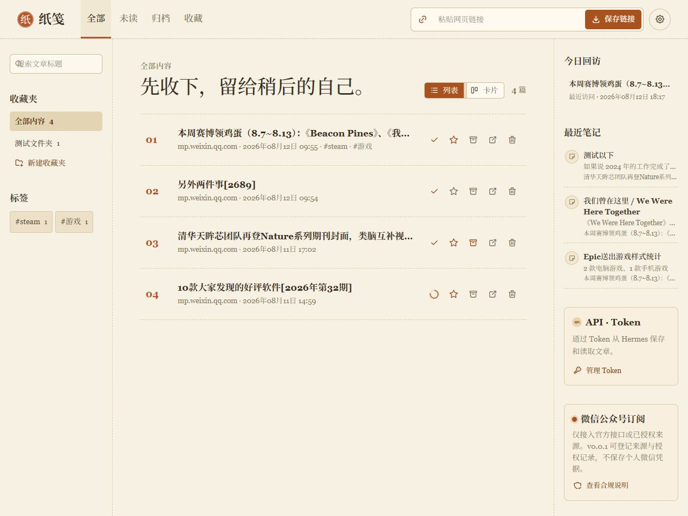

# PaperLeaf · 纸笺 v0.0.1

PaperLeaf 是一个用于保存、净化和离线阅读网页的个人阅读服务。本仓库只提供 Docker 部署版本；数据库和文章文件均在部署后于本机持久化，不会包含在 Git 提交中。



## 功能

- 保存原始 URL，抓取标题、描述、正文和图片，生成安全 HTML 快照
- 文章 HTML、下载图片和后续 PDF 文件独立存储；原网址失效后仍可阅读已归档内容
- 全部、未读、归档、收藏视图，标签、收藏夹、标题搜索、列表和卡片视图
- 阅读进度、已读切换、收藏、归档、打印为 PDF、高亮和笔记
- 管理员用户和密码管理，批量 URL 导入、JSON/CSV 导出
- Token 管理，以及 Hermes 兼容的文章保存和查询 API

不包含个人微信登录、Cookie 托管、客户端模拟或规避平台风控的抓取能力。

## Docker 部署

### 1. 准备配置

```powershell
Copy-Item .env.example .env
```

编辑 `.env` 后再启动。首次初始化默认账号为 `admin`，密码为 `admin123`；仅用于首次部署，请在登录后立即修改为强密码。

```dotenv
PAPERLEAF_PORT=3080
PAPERLEAF_ADMIN_USER=admin
PAPERLEAF_ADMIN_PASSWORD=admin123
```

### 2. 启动

```powershell
docker compose up -d --build
docker compose ps
```

访问 `http://<服务器地址>:3080`。服务健康检查地址为 `/api/health`。

`docker-compose.yml` 只暴露一个端口：`${PAPERLEAF_PORT:-3080}` 到容器内的 `3080`。

## 持久化与备份

Compose 会在本仓库目录创建以下目录，二者都含有个人数据，已被 `.gitignore` 排除：

| 宿主机目录 | 容器目录 | 内容 |
| --- | --- | --- |
| `./data` | `/app/data` | SQLite 数据库、会话、Token、文章元数据和偏好 |
| `./library` | `/var/lib/paperleaf/library` | `article.html`、本地图片和后续 `article.pdf` |

升级或恢复时请同时备份/恢复 `data/` 与 `library/`。不要上传 `.env`、`data/` 或 `library/` 到 GitHub。

## Hermes API

先在设置页面创建具备 `items:write` 或 `items:read` 权限的 Token。完整 Token 只在创建时显示一次。

```powershell
$headers = @{ Authorization = "Bearer pl_your_token"; "Content-Type" = "application/json" }
Invoke-RestMethod -Method Post -Uri "http://127.0.0.1:3080/api/v1/items" -Headers $headers -Body '{"url":"https://example.com/article","tags":["待整理"]}'
Invoke-RestMethod -Method Get -Uri "http://127.0.0.1:3080/api/v1/items?status=unread" -Headers $headers
```

| 方法 | 路径 | 权限 |
| --- | --- | --- |
| `POST` | `/api/v1/items` | `items:write` |
| `GET` | `/api/v1/items` | `items:read` |
| `GET` | `/api/v1/items/:id` | `items:read` |

## 发布范围

本仓库不含本地 npm 开发依赖、测试、浏览器扩展、维护脚本、开发文档、备份或未获授权发布的历史截图。README 中的首页截图已获作者授权发布。完整边界见 [GITHUB_RELEASE_CONTENTS.md](GITHUB_RELEASE_CONTENTS.md)。
